Pastimes Digital Atelier - README

 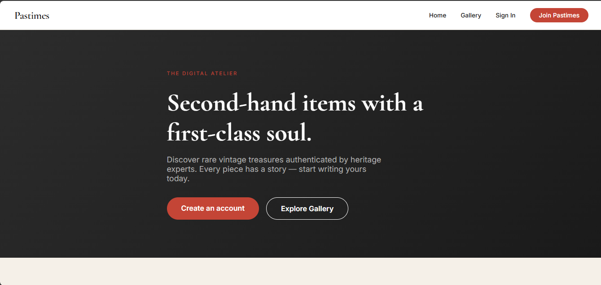 

📖 Overview
Pastimes Digital Atelier is a curated heritage fashion marketplace platform where users can buy, sell, and discover vintage and pre-loved clothing items. The platform connects buyers with sellers, features an admin panel for moderation, and includes a complete messaging and notification system.

 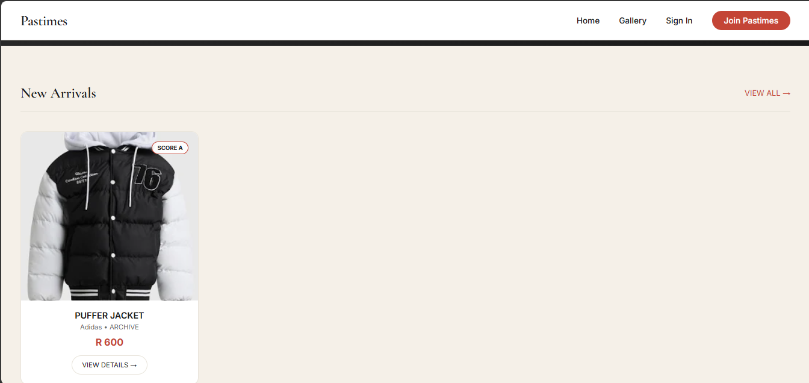 

🚀 Features
👤 User Features
User Registration & Login - Secure registration with password hashing and email verification

Role-Based Access - Three user roles: Buyer, Seller, and Admin

Profile Management - Users can update their profile information

 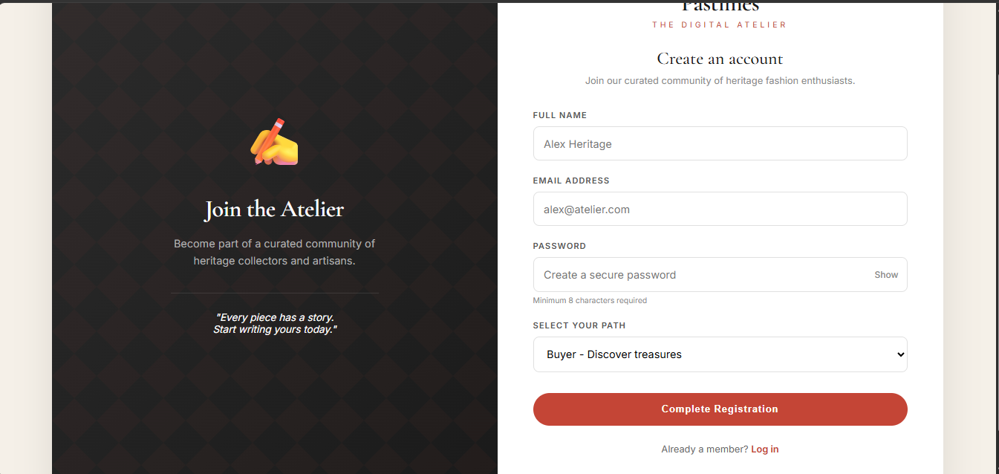 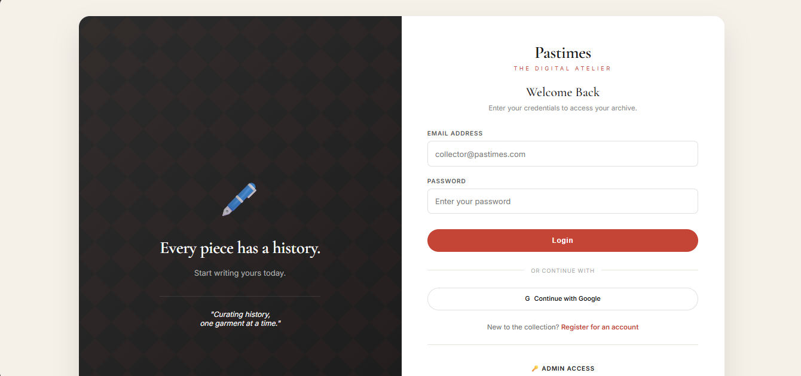 

🛍️ Buyer Features
Browse Gallery - View approved clothing items with filters (brand, sustainability score, price range, condition)

Product Details - View detailed product information with images

Shopping Cart - Add/remove items, view cart summary

Checkout Process - Complete purchases with shipping address and payment method

 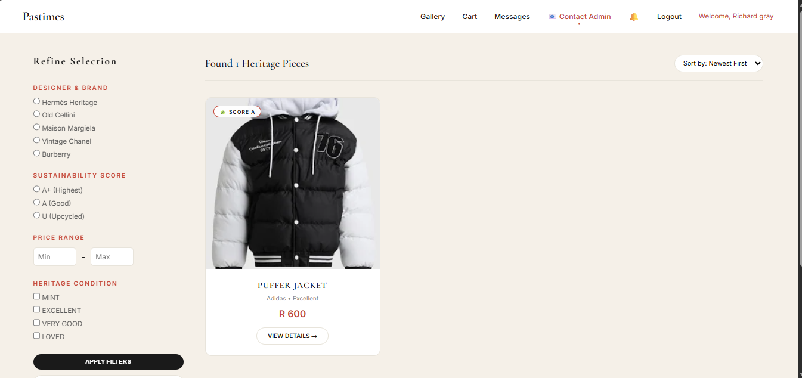 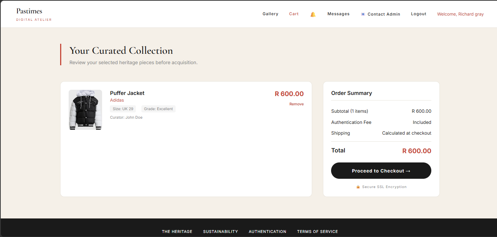 

📦 Seller Features
Create Listings - Upload items with title, description, price, brand, size, condition, and images

Image Upload - Drag-and-drop image upload with preview

Manage Listings - View all uploaded items and their approval status

AI Suggestions - Automated suggestions for titles and valuations (demo feature)

 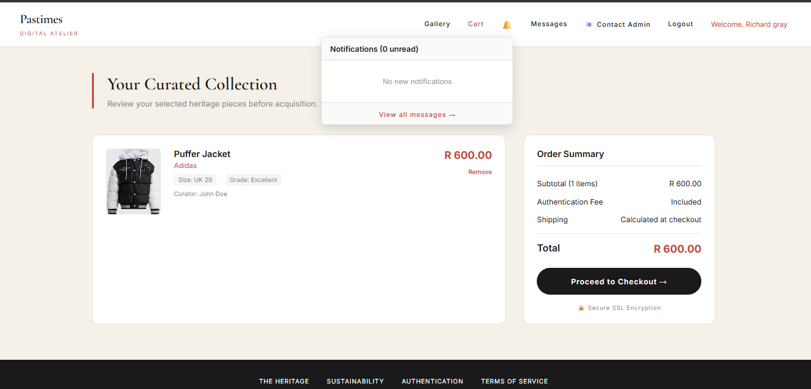 

💬 Messaging System
User-to-User Messaging - Buyers can message sellers about products

Admin Communication - Users can contact admin via dedicated page

Admin Inbox - Centralized messaging dashboard for administrators

Real-time Notifications - Bell icon with unread message count

Conversation Threads - Full chat history between users

 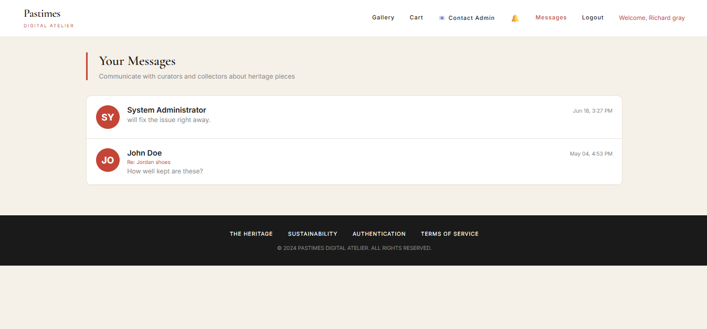 

👑 Admin Features
Admin Dashboard - Overview of sales, users, listings, and system status

User Management - Verify, edit, and delete user accounts

Listing Management - Approve, reject, or delete clothing listings

Seller Verification - Review and approve new seller applications

Content Moderation - Ensure quality and authenticity of listings

 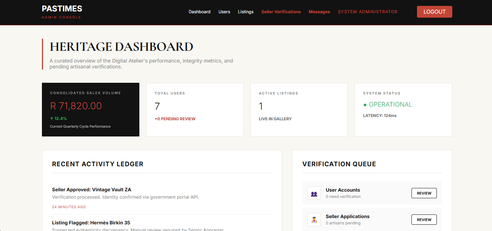 

 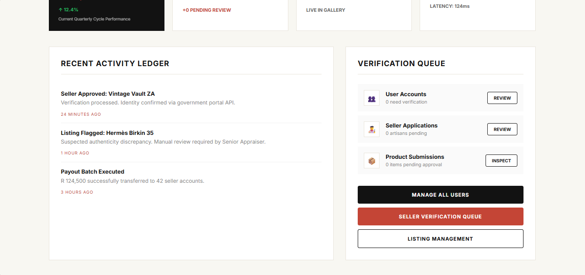 

🔔 Notification System
Real-time Notifications - Instant notifications for messages, approvals, and system events

Unread Badge - Visual indicator for unread messages and notifications

Notification Dropdown - Quick view of recent notifications

🎨 Design Features
Responsive Design - Works on desktop, tablet, and mobile devices

Elegant Aesthetic - Heritage-inspired design with red accent color

Typography - Cormorant Garamond and Inter fonts

Consistent UI - Unified design across all pages

🗂️ Database Structure
Tables
Table	Description
tblUser	User accounts (buyers, sellers, admins)
tblAdmin	Administrator accounts
tblClothes	Clothing listings
tblAorder	Order records
tblCart	Shopping cart items
tblTransactions	Payment transactions
tblMessages	User messages
tblConversations	Message conversations
tblNotifications	System notifications
Key Relationships
tblClothes.seller_id → tblUser.user_id

tblAorder.buyer_id → tblUser.user_id

tblAorder.seller_id → tblUser.user_id

tblMessages.sender_id → tblUser.user_id

tblMessages.receiver_id → tblUser.user_id

tblConversations.user1_id → tblUser.user_id

tblConversations.user2_id → tblUser.user_id

🛠️ Installation Guide
Prerequisites
XAMPP (Apache, MySQL, PHP) or similar web server

PHP 7.4+

MySQL 5.7+

Step-by-Step Installation
1. Clone or Download the Project
text
git clone https://github.com/yourusername/pastimes-Atelier.git
Or download the ZIP file and extract it.

2. Move to XAMPP htdocs
bash
# Windows
C:\xampp\htdocs\ClothingStore\

# Mac
/Applications/XAMPP/htdocs/ClothingStore/

# Linux
/opt/lampp/htdocs/ClothingStore/
3. Start XAMPP Services
Open XAMPP Control Panel

Start Apache (Web Server)

Start MySQL (Database)

4. Create Database
Open phpMyAdmin: http://localhost/phpmyadmin

Click "New" on the left sidebar

Enter database name: ClothingStore

Choose utf8mb4_general_ci as collation

Click "Create"

5. Import Database Structure
Option A: Use the Setup Script

Navigate to: http://localhost/ClothingStore/loadClothingStore.php

This will automatically create all tables and load sample data

Option B: Manual Import

Open phpMyAdmin

Select the ClothingStore database

Click "Import" tab

Select myClothingStore.sql file

Click "Go"

6. Configure Database Connection
The DBConn.php file already contains the default XAMPP settings:

php
$servername = "localhost";
$username = "root";
$password = "";
$dbname = "ClothingStore";
7. Set Uploads Folder Permissions
bash
# Windows - Right-click uploads folder > Properties > Security > Give write permissions
# Mac/Linux
chmod 755 uploads/
8. Access the Application
Open your browser and go to:

text
http://localhost/ClothingStore/
🔑 Demo Credentials
Admin Account
Field	Value
Email	admin@pastimes.com
Password	admin123
Seller Account
Field	Value
Email	eliza@pastimes.com
Password	admin123
Buyer Account
Field	Value
Email	john@example.com
Password	admin123
📁 File Structure
text
ClothingStore/
├── admin/
│   ├── dashboard.php          # Admin dashboard
│   ├── messages.php           # Admin message inbox
│   ├── conversation.php       # Admin conversation view
│   ├── manage_users.php       # User management
│   ├── edit_user.php          # Edit user
│   ├── edit_item.php          # Edit listing
│   ├── approve_items.php      # Approve listings
│   └── seller_verification.php # Seller verification queue
├── seller/
│   ├── my_atelier.php         # Seller dashboard
│   └── sell_item.php          # Create listing
├── includes/
│   └── notification_functions.php # Notification helpers
├── uploads/                    # Product images
├── styles/
│   └── style.css              # Main stylesheet
├── index.php                   # Landing page
├── login.php                   # Login page
├── register.php                # Registration page
├── logout.php                  # Logout script
├── marketplace.php             # Gallery view
├── product_details.php         # Product details
├── cart.php                    # Shopping cart
├── checkout.php                # Checkout process
├── checkout_complete.php       # Order confirmation
├── messages.php                # Message inbox
├── conversation.php            # Conversation view
├── contact_admin.php           # Contact admin page
├── send_message.php            # Send message handler
├── get_notifications.php       # AJAX notifications
├── get_notification_count.php  # AJAX badge count
├── DBConn.php                  # Database connection
├── config.php                  # Configuration
├── createTable.php             # Create/reload users table
├── loadClothingStore.php       # Setup database
├── userData.txt                # Sample user data
└── myClothingStore.sql         # Full database export
📸 Page Screenshots
Landing Page

  

New Arrivals Section

  

Registration Page

  

Login Page

  

Gallery / Marketplace

  

Shopping Cart

  

Cart Summary

  

Messages Inbox

  

Admin Dashboard

  

Admin Dashboard Stats

  

Admin User Management

 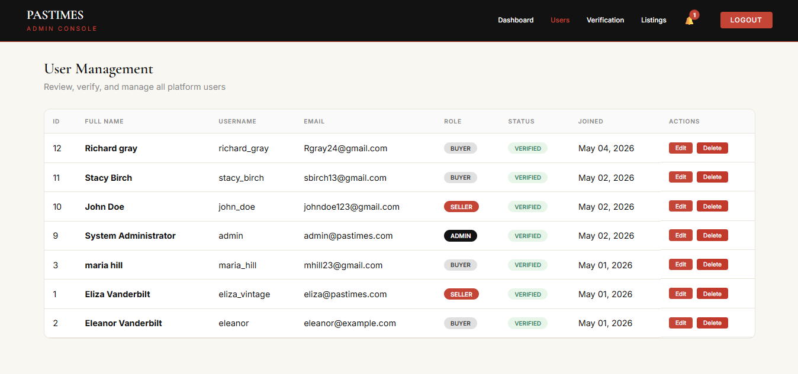 

Edit User

 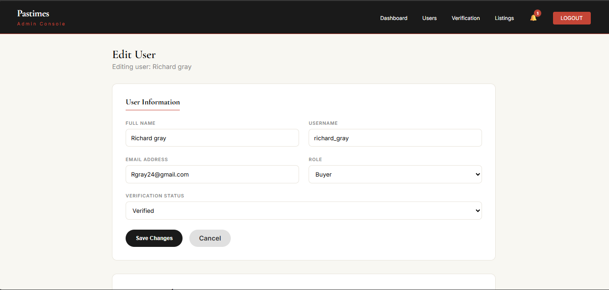 

Edit User - Extended

 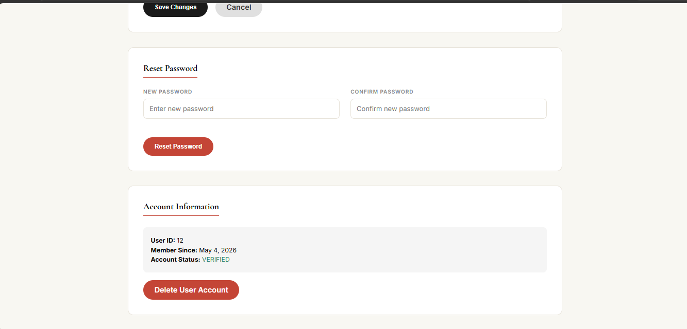 

Seller Verification Queue

 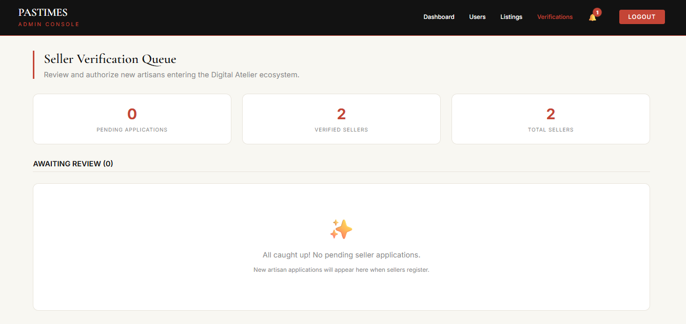 

Listing Approval Queue

 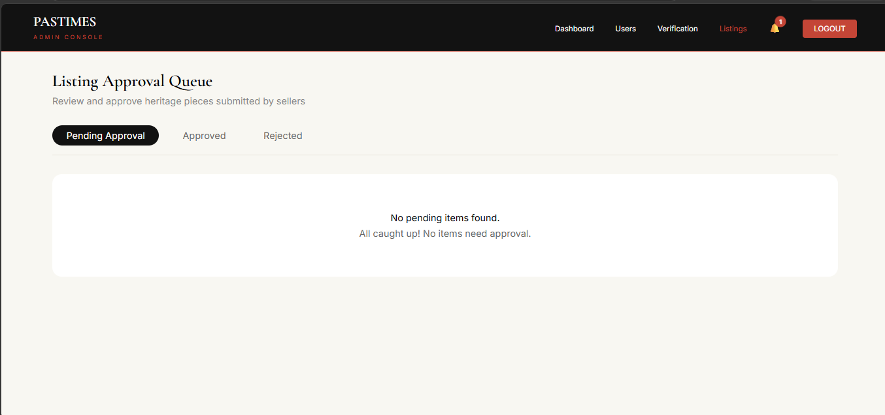 

Admin Messages

 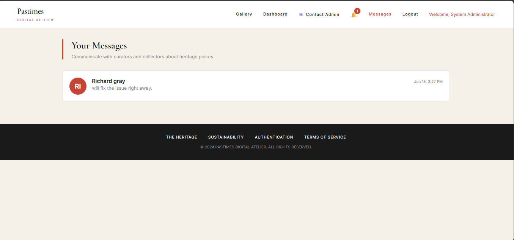 

🧪 Testing
Test Flows
Buyer Flow
Register as Buyer → Login → Browse Gallery → View Product → Add to Cart → Checkout → Order Complete

Seller Flow
Register as Seller → Login → My Atelier → Sell Item → Submit → Wait for Admin Approval

Admin Flow
Login as Admin → Dashboard → Approve Users → Approve Listings → Manage Users → Edit Items → Communicate with Users

API Endpoints
get_notifications.php - Returns JSON array of unread notifications

get_notification_count.php - Returns JSON with total unread count

🎨 Design Guidelines
Color Palette
Color	Hex Code	Usage
Red Accent	#c44536	Buttons, links, badges, highlights
Dark	#1a1a1a	Headers, footers, primary text
Cream Background	#f5f0e8	Page backgrounds
White	#ffffff	Cards, forms, containers
Typography
Font	Usage
Cormorant Garamond	Headings, logos, product titles
Inter	Body text, buttons, form inputs
🐛 Troubleshooting
Common Issues
"Connection failed" error
Make sure XAMPP MySQL is running

Check database name in DBConn.php

"404 Not Found"
Make sure you're accessing via http://localhost/ClothingStore/ not file path

Check if the file exists in the correct folder

Images not uploading
Check uploads/ folder permissions (must be writable)

Maximum file size is 5MB

Allowed formats: JPG, JPEG, PNG, GIF, WEBP

Notifications not working
Ensure tblNotifications table exists

Check get_notifications.php file exists in root folder

Messages not showing in admin
Ensure conversations are created in tblConversations

Run the SQL query to create conversations from existing messages

📝 Dependencies
PHP 7.4+

MySQL 5.7+

XAMPP/Apache

Google Fonts - Cormorant Garamond, Inter

👨‍💻 Author
Pastimes Digital Atelier Development Team

📞 Support
For support, please contact the administrator via the "Contact Admin" page in the application.

✨ Future Enhancements
Payment gateway integration (Stripe/PayPal)

Email notifications

Advanced search and filtering

Wishlist feature

Product reviews and ratings

Seller analytics dashboard

Bulk image upload

Social media login

Mobile app (React Native)
